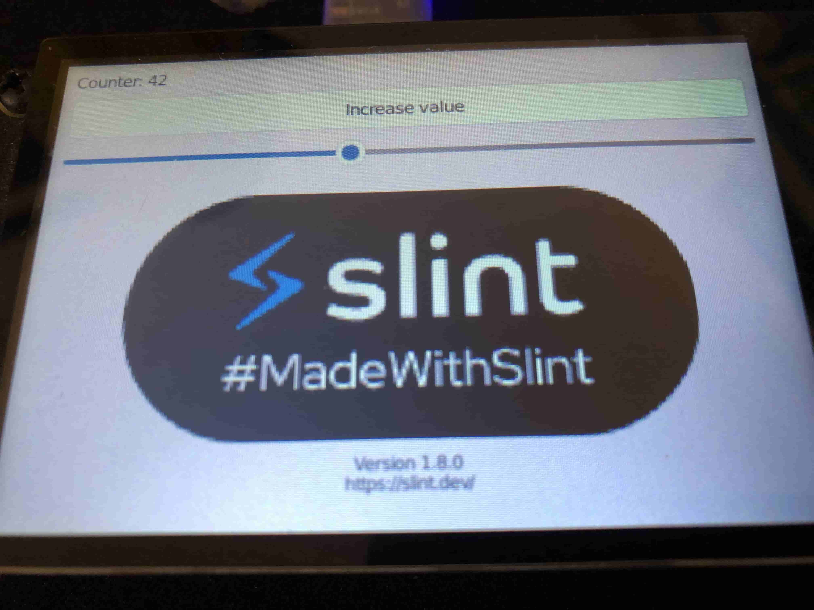

# Slint porting for Pico_DM_QD3503728



A template for a Rust Microcontroller(MCU) application that's using [Slint](https://slint-ui.com) for the user interface.

## About

This template helps you get started developing a bare metal MCU Rust application with Slint as toolkit for the user interface.
It shows how to implement the `slint::platform::Platform` trait, and displays a simple `.slint` design on the screen.

For a template about using Slint with an operating system (Desktop, or Embedded Linux), check out the
classic template at https://github.com/slint-ui/slint-rust-template.

## Usage

1. Download and extract the [ZIP archive of this repository](https://github.com/slint-ui/slint-mcu-rust-template/archive/refs/heads/main.zip).
2. Rename the extracted directory and change into it:
    ```
    mv slint-mcu-rust-template-main my-project
    cd my-project
    ```
3. Run on the Desktop (Simulator)
    ```
    cargo run --features simulator
    ```
4. If you have a [RaspberryPi Pico](https://www.raspberrypi.com/products/raspberry-pi-pico/) with a [2.8 inch Waveshare Touch Screen](https://www.waveshare.com/pico-restouch-lcd-2.8.htm):

   a. Install the cargo extension to create UF2 images for the RP2040 USB Bootloader
      ```
      cargo install flip-link
      cargo install --locked probe-rs-tools
      cargo install elf2uf2-rs --locked
      ```

   b. Run on the device
      ```
      cargo run --target=thumbv6m-none-eabi --features=pico --release
      ```

In order to port to your device, you will have to replace all the code that is specific to the RaspberryPi Pico.
See also the instructions on https://slint-ui.com/snapshots/master/docs/rust/slint/docs/mcu/index.html

## Next Steps

We hope that this template helps you get started and you enjoy exploring making user interfaces with Slint. To learn more
about the Slint APIs and the `.slint` markup language check out our [online documentation](https://slint-ui.com/docs/rust/slint/).

Don't forget to edit this readme to replace it by yours, and edit the `name =` field in `Cargo.toml` to match the name of your project.